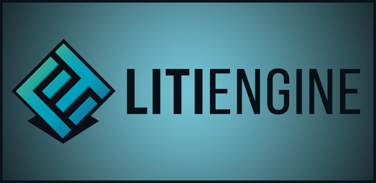

**LITIENGINE** is a free and open source Java 2D Game Engine. It provides a comprehensive Java library and a dedicated map editor to create tile-based 2D games.

[](https://github.com/gurkenlabs/litiengine/actions/workflows/build.yml)
[](https://sonarcloud.io/dashboard?id=de.gurkenlabs%3Alitiengine)
[](https://maven-badges.herokuapp.com/maven-central/de.gurkenlabs/litiengine)
[](https://github.com/gurkenlabs/litiengine/blob/master/LICENSE)
[](https://discord.gg/rRB9cKD)
[](https://opencollective.com/litiengine)


## :video_game: Main Features

* Basic Game Infrastructure (GameLoop, Configuration, Resource Management, Logging, ...)
* 2D Render Engine (GUI Components, Spritesheet Animations, Ambient Lighting, Particle System, ...)
* 2D Sound Engine (support for .wav, .mp3 and .ogg)
* 2D Physics Engine
* Support for Tile Maps in .tmx format (e.g. made with [Tiled Editor](http://www.mapeditor.org/))
* Player Input via Gamepad/Keyboard/Mouse
* Entity Framework

## :gear: Installation
The library is distributed over the [Maven Central Repository](https://search.maven.org/artifact/de.gurkenlabs/litiengine) and you can grab the necessary .jar-file(s) from there by using your favorite build automation tool or manually download the library.

### Gradle
Our library is primarily hosted by the Maven Central Repository:
```groovy
repositories {
  mavenCentral()
}
```

#### Gradle (Groovy)
```groovy
dependencies {
  implementation 'de.gurkenlabs:litiengine:0.5.2'
}
```

#### Gradle (Kotlin)
```kotlin
dependencies {
  implementation("de.gurkenlabs:litiengine")
}
```
[More Installation Instructions](https://litiengine.com/docs/getting-started/get-litiengine/)
## :rocket: Getting Started

1. [Setup the Game Project](https://litiengine.com/docs/getting-started/)
2. [Running the Game](https://litiengine.com/docs/getting-started/run-the-game/)
3. [Configuring the Game](https://litiengine.com/docs/configuration/)
4. [Loading a .tmx Map](https://youtu.be/RR3QxOhV8hM)

## :books: Documentation
The [LITIENGINE documentation pages](https://litiengine.com/docs/) contain in-depth guides and explanations for general concepts of the engine.

> :warning: We are aware that some parts of the engine are **lacking documentation**. Feel free to join our [Discord](https://discord.gg/rRB9cKD) and discuss any open questions. Our great community is always very helpful.
> 
> :pencil2: If you like writing and explaining: We're looking for further contributors to enhance the official documentation. Just file an issue or create a PR on the [Documentation Github Repository](https://github.com/gurkenlabs/litiengine-docs).


If you are searching for a particular method or class within the API or just want to further explore the engine's possiblities, the Javadocs are a good place to start. 

[](https://litiengine.com/api/) 
### Questions?
Visit the official [LITIENGINE forum](https://forum.litiengine.com/) for troubleshooting or to learn about the LITIENGINE community. If you encounter bugs or want to request fancy new features, you can also open an issue in our [Issue Tracker](https://github.com/gurkenlabs/litiengine/issues).

## :package: Libraries Used

* [JInput](https://github.com/jinput/jinput) for Gamepad support
* [MP3 SPI](https://mvnrepository.com/artifact/com.googlecode.soundlibs/mp3spi/1.9.5.4) for .mp3 support
* [Ogg Vorbis SPI](https://mvnrepository.com/artifact/com.googlecode.soundlibs/vorbisspi/1.0.3.3) for .ogg support

### utiLITI 
* [Darklaf](https://github.com/weisJ/darklaf) for theming support

### Other Recommended Libraries
* [Steamworks4j](https://github.com/code-disaster/steamworks4j) for supporting the steamworks SDK

## :handshake: Contributing
* Agree to our [Code of Conduct](https://github.com/gurkenlabs/litiengine/blob/master/CODE_OF_CONDUCT.md)
* View our [Contribution guidelines](https://github.com/gurkenlabs/litiengine/blob/master/CONTRIBUTING.md)

## :mortar_board: Citations
If you want to cite parts of the LITIengie in your academic work, you can use the following Digital Object Identifier:

[](https://zenodo.org/badge/latestdoi/87944612)

## :speech_balloon: Contact
* Website [litiengine.com](https://litiengine.com)
* Twitter [@gurkenlabs](https://twitter.com/gurkenlabs)
* Facebook [gurkenlabsofficial](https://www.facebook.com/gurkenlabsofficial/)
* YouTube [Gurkenlabs](https://www.youtube.com/channel/UCN7-9zYTxip_Hl1LvCQ8RBA)
* Bug Reports [Issue Tracker](https://github.com/gurkenlabs/litiengine/issues)
* E-Mail info@litiengine.com
* Forum [forum.litiengine.com](https://forum.litiengine.com/)

## Authors


**Gurkenlabs** is an indie game development project by two brothers from Bavaria:
* Steffen Wilke ([steffen-wilke](https://github.com/steffen-wilke))
* Matthias Wilke ([nightm4re94](https://github.com/nightm4re94))

## Sponsors and supporters

[](https://opencollective.com/litiengine#support)
