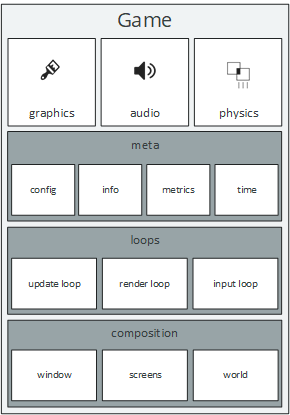

# The Game API



[`de.gurkenlabs.litiengine.Game`](https://static.javadoc.io/de.gurkenlabs/litiengine/0.4.14/de/gurkenlabs/litiengine/Game.html) is 
undoubtedly one of the classes that you will call the most when creating a game with LITIengine.
It is designed to be the static container that provides access to all important aspects of the engine, e.g. it holds the GameInfo, the RenderEngine, the SoundEngine and many other major components.

We designed the API such that all important parts that make up the game are directly accessible via the Game class statically.
To be more technical, it is essentially a collection of core Singleton instances.

The Game class will also be your starting point when setting up a new LITIengine project.
In order to launch your game,  you need to at least call [`Game.init(String... args)`](https://static.javadoc.io/de.gurkenlabs/litiengine/0.4.14/de/gurkenlabs/litiengine/Game.html#init-java.lang.String...-) and [`Game.start()`](https://static.javadoc.io/de.gurkenlabs/litiengine/0.4.14/de/gurkenlabs/litiengine/Game.html#start--) from your program's `main(String[] args)` method.

Additionally, event listeners for the most basic operations of a Game life cycle can be registered in the Game class, as can be seen in the following example.

Example snippet:
```java
Game.init();
Game.start();
Game.addGameTerminatedListener(() -> 
{
  // do sth when game is shut down
});

System.out.println("Game version is: " + Game.getInfo().getVersion());

Game.getSoundEngine().playSound(Sound.get("test.ogg"));
```
