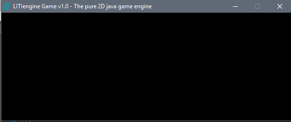

# Run the Game

Now that you have a basic project structure with the LITIengine referenced, your next step is to bring it all together and run the game for the first time.

## Create an Application Entry Point
Since the LITIengine is a normal Java application, it needs to have an [Application Entry Point](https://docs.oracle.com/javase/tutorial/deployment/jar/appman.html) in order for the JVM to know what to execute when launching the application. For that, we need a simple class that provides a static `main(String[] args)` method. We suggest to create a new class with a name similar to `Program` or `GameRunner` but the name doesn't really matter as long as the class provides the entry point.

An example implementation would look like this:

```java
public class Program {

  /**
   * The main entry point for the Game.
   * 
   * @param args
   *          The command line arguments.
   */
  public static void main(String[] args) {
  }
}
```

We recommend you to keep this class as clean and minimalist as possible so that this class is only responsible for starting up the game. It's good practice to locate all your game logic in other classes.

## Initialize and Start the Game

After successfully setting up the application entry point, it's time to actually use the LITIengine. The following example will initialize the `Game` infrastructure with the specified command-line arguments. Upon calling the method `Game.start()` an empty window will be spawned that renders a black background and a title with the LITIengine logo.

```java
public class Program {

  /**
   * The main entry point for the Game.
   * 
   * @param args
   *          The command line arguments.
   */
  public static void main(String[] args) {
    Game.init(args);
    Game.start();
  }
}
```

If you see the following window, you’ve setup everything correctly and are now ready to create  awesome 2D Java games with the LITIengine!

