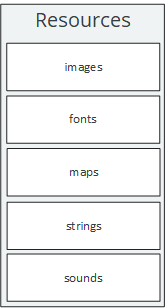

# The Resources API

The static `Resources` class is the engine's entry point for accessing any kind of resource from within your LITIengine project.
A resource is any non-executable data that is deployed with your game.
The `Resources` class provides access to types of `ResourcesContainer` and is used by different (loading) mechanisms to make resources available during runtime.
LITIengine supports various different resource types, including:
* images
* fonts
* maps
* (localizable) strings
* spritesheets
* sounds
 
## Resource Containers
`ResourcesContainer` is an abstract implementation for all classes that contain a certain resource type.
Basically, it's an in-memory cache of the resources and provides access to manage the resources.
 
Internally, the resources are stored in a `ConcurrentHashMap` where the keys are String identifiers and the values are your individual resource objects.

There are various overloads for `ResourcesContainer.add(...)` and `ResourcesContainer.get(...)`, allowing you to adjust these operations to your needs.
All the `ResourcesContainer`'s contents and its listeneres can be discarded with `ResourcesContainer.clear()`.

### Listeners

You can register `ResourcesContainerListener`s with `addContainerListener(ResourcesContainerListener<T> listener)` to get notified whenever a resource was added to or removed from your `ResourcesContainer`.
Removing listeners works analogically with `removeContainerListener(ResourcesContainerListener<T> listener)`
