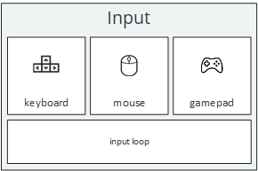

# The Input API



Example snippet:
```java
if (Input.mouse().isPressed() && Input.mouse().isLeftMouseButtonDown()) {
  // do something when the left mouse button is pressed
}

Input.keyboard().onKeyReleased(KeyEvent.VK_ENTER, key -> {
 // do something when "enter" is released
});

Input.keyboard().onKeyPressed(event -> {
  if (event.getKeyCode() == KeyEvent.VK_BACK_SPACE) {
    // do something on "space" is pressed
  }
});

Input.gamepadManager().onPressed(Gamepad.Xbox.LEFT_STICK_Y, pollValue -> {
  if (pollValue > 0) {
    System.out.println("MOVE DOWN");
  }

  if (pollValue > 0) {
    System.out.println("MOVE UP");
  }
});

Input.gamepadManager().onPressed((button, value) -> {
  // for simple buttons, the value doesn't really matter -> no need to check against it
  if (button.equals(Gamepad.Xbox.A)) {
    System.out.println("A PRESSED");
  } else if (button.equals(Gamepad.Xbox.B)) {
    System.out.println("B PRESSED");
  }
});
```